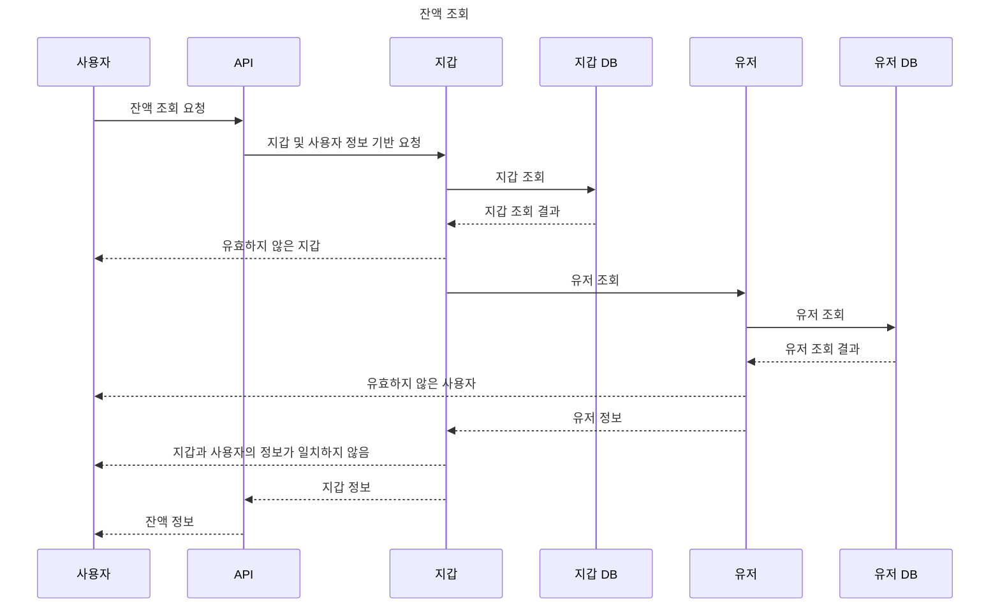
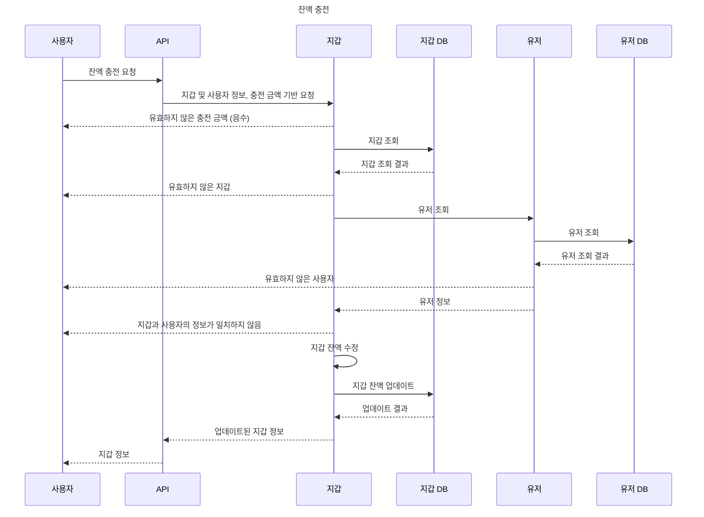
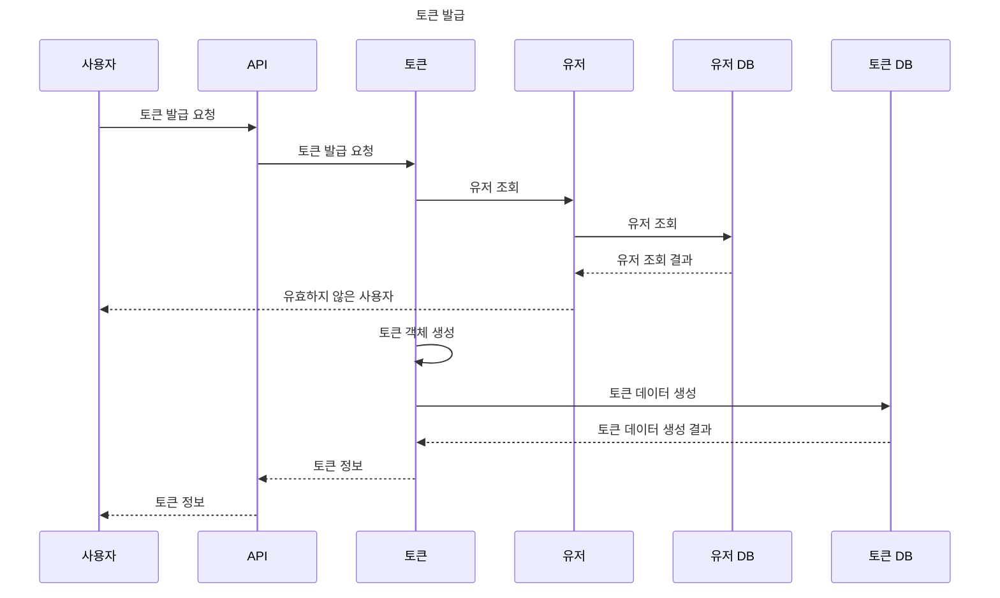
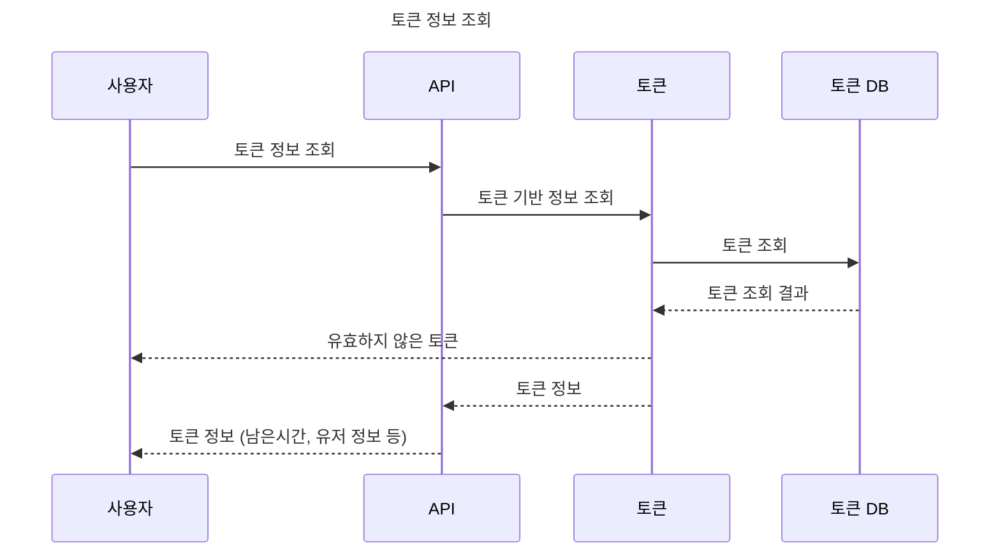
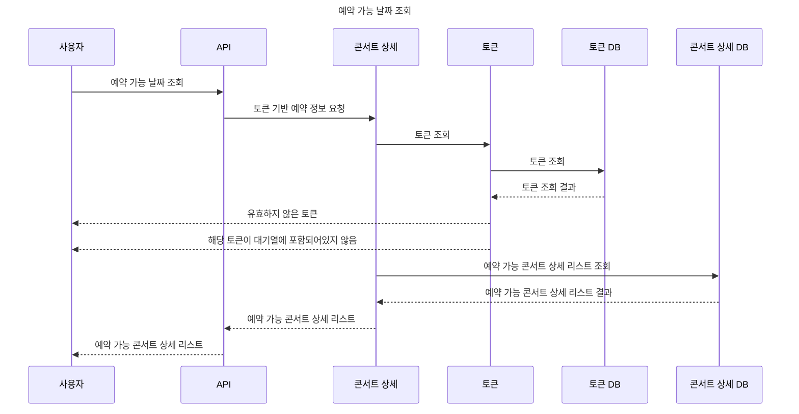
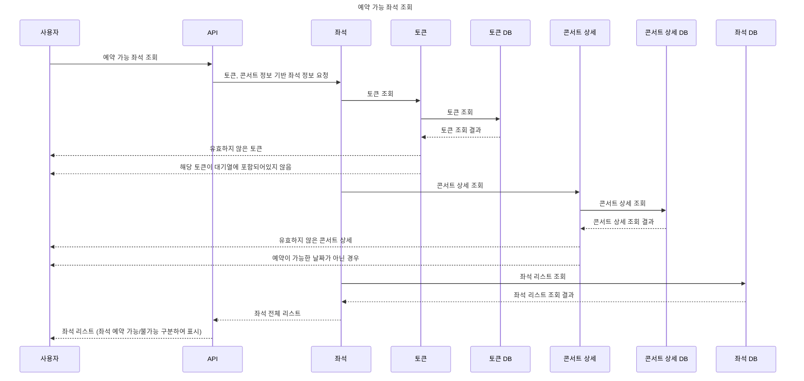
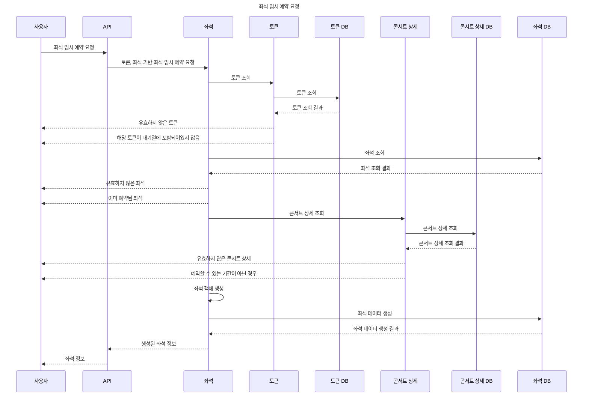
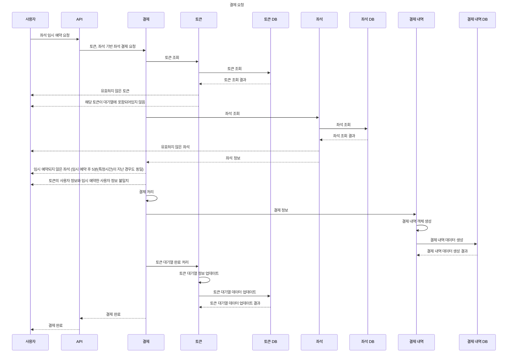

# 마일스톤
- 링크 : https://www.edrawmax.com/online/share.html?code=1e8cc8663a2811efa9330a54be41f961

# 시퀀스 다이어 그램

잔액 조회

### 잔액 조회

잔액 충전

### 잔액 충전

토큰 발급

### 토큰 발급

토큰 정보 조회

### 토큰 정보 조회

예약 가능 날짜 조회

### 예약 가능 날짜 조회

예약 가능 좌석 조회

### 예약 가능 좌석 조회

좌석 임시 예약 요청

### 좌석 임시 예약 요청

결제 요청

### 결제 요청

