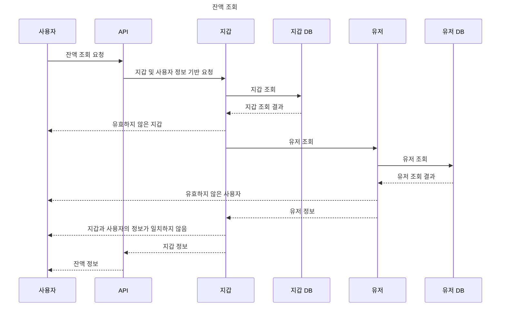
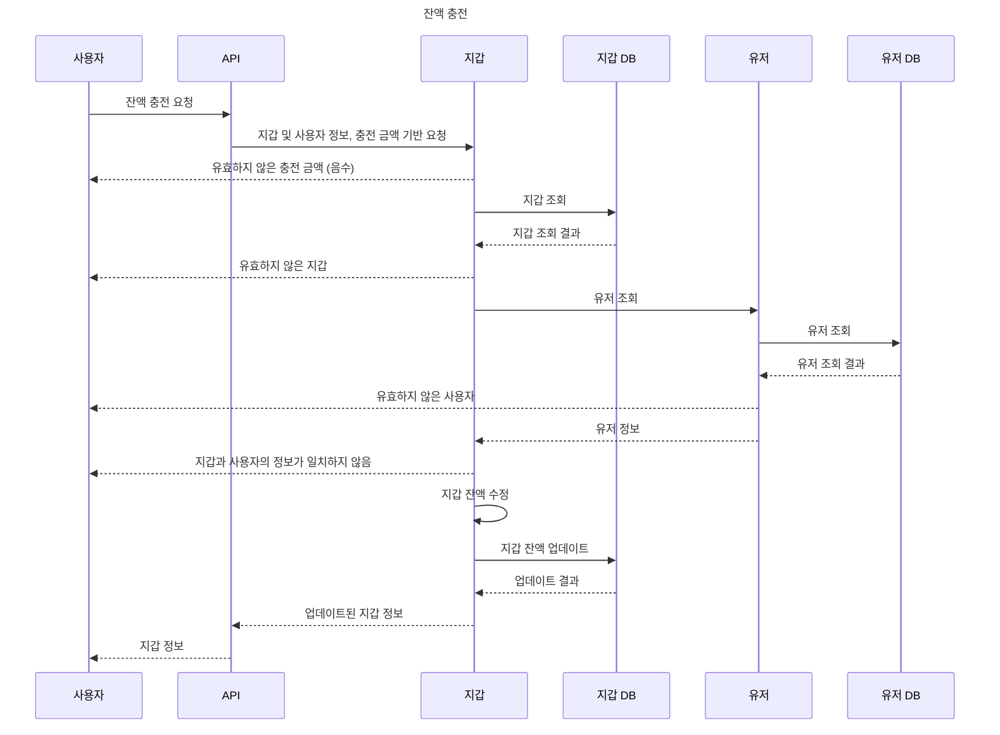
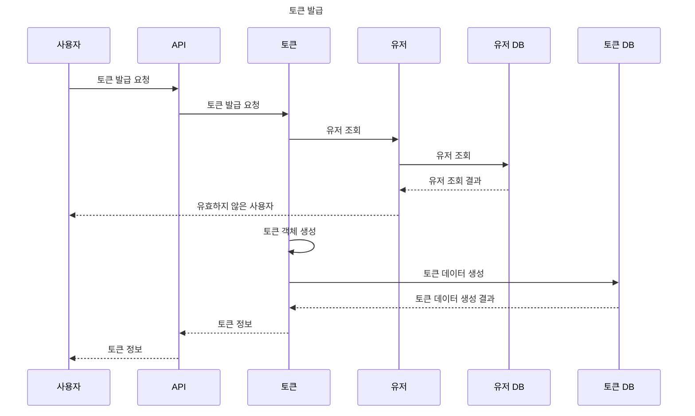
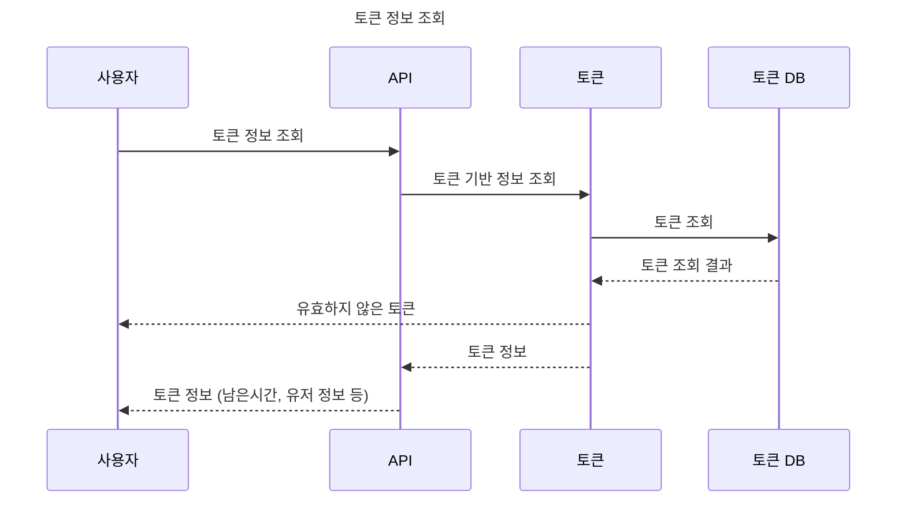
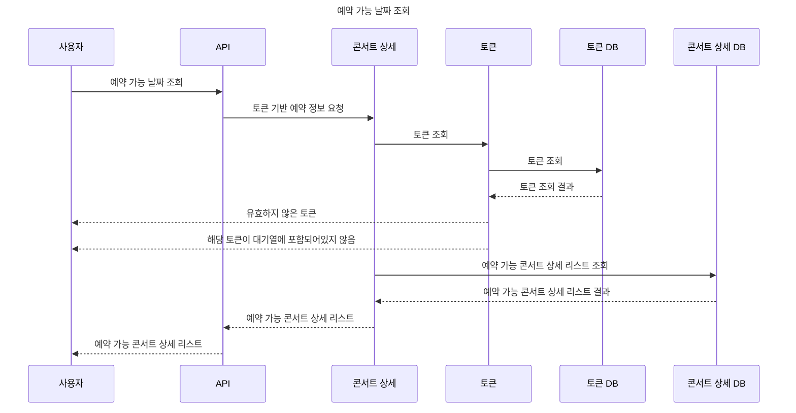
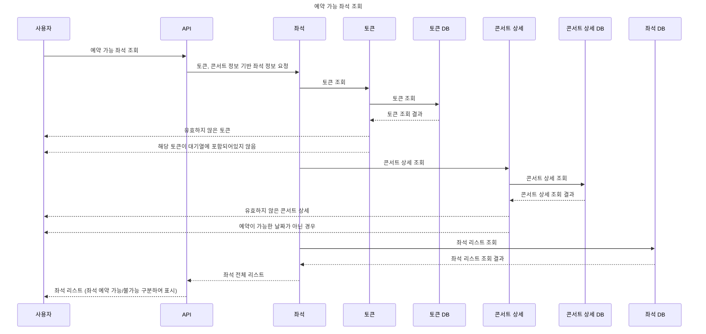
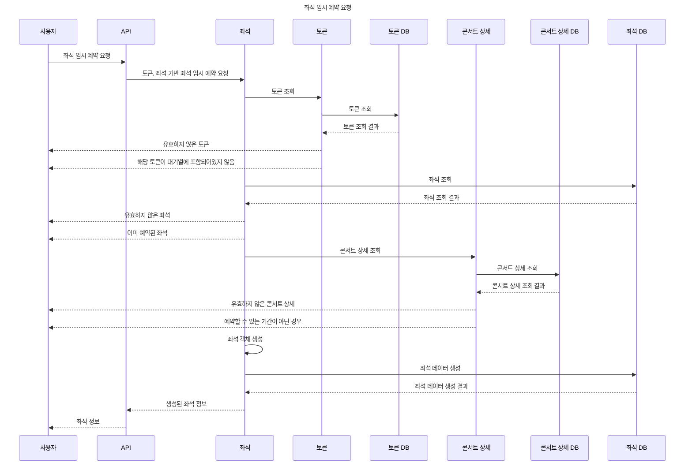
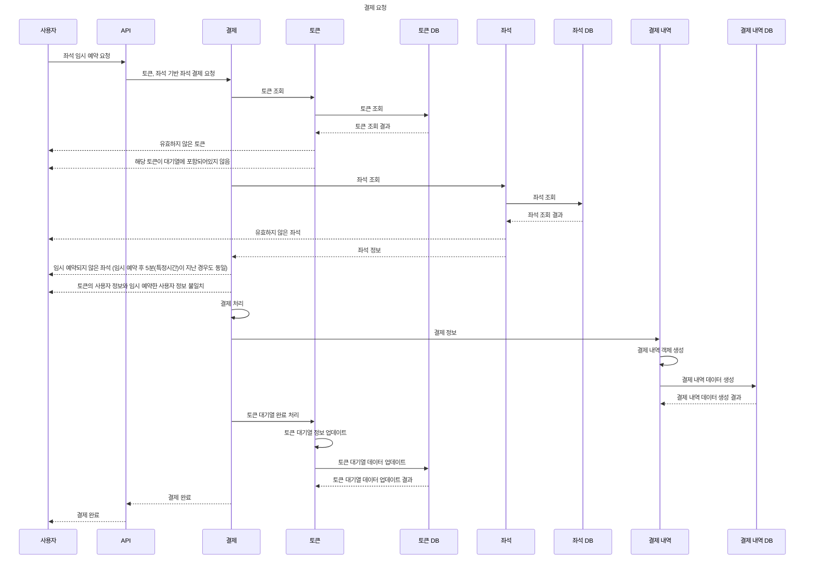

# 마일스톤
- 링크 : https://www.edrawmax.com/online/share.html?code=1e8cc8663a2811efa9330a54be41f961

# 시퀀스 다이어 그램
<details>
<summary>잔액 조회</summary>

### 잔액 조회

</details>

<details>
<summary>잔액 충전</summary>

### 잔액 충전

</details>


<details>
<summary>토큰 발급</summary>

### 토큰 발급

</details>

<details>
<summary>토큰 정보 조회</summary>

### 토큰 정보 조회

</details>

<details>
<summary>예약 가능 날짜 조회</summary>

### 예약 가능 날짜 조회

</details>

<details>
<summary>예약 가능 좌석 조회</summary>

### 예약 가능 좌석 조회

</details>

<details>
<summary>좌석 임시 예약 요청</summary>

### 좌석 임시 예약 요청


</details>


<details>
<summary>결제 요청</summary>

### 결제 요청

</details>

# ERD 설계
- 링크 : https://dbdiagram.io/d/콘서트-예약-6684e7659939893daee5ee0f


# 동시성 이슈
<details>
<summary>프로젝트내에서 동시성 문제가 발생할 수 있는 케이스</summary>

### 프로젝트내에서 동시성 문제가 발생할 수 있는 케이스
- 좌석 임시 예약 (좌석 -> 분산락(Simple Lock) + 비관적락(S-Lock))
  - 여러명의 사용자가 동일한 좌석을 선택하여 예약하려고 하는 경우 분산락을 통해 한 명의 사용자에게만 Lock을 제공하며 빠르게 에러 처리
    - redis에 문제가 발생하는 경우 별도의 처리 필요...
  - 비관적락(S-Lock)을 사용하여, 다른 트랜잭션에서의 조회에 영향을 주지 않게 하여 비관적락 (X-Lock)에 비해 성능 향상
- 좌석 결제 (좌석 -> 낙관적 락, 지갑 -> 비관적 락 (X-Lock))
  - 좌석 결제는 한명의 사용자가 임시 예약한 좌석을 대상으로 결제를 하는 로직이기에 동시성 이슈가 많이 발생하지 않기에 낙관적 락 사용
  - 좌석에 대해 DB Lock을 사용하지 않고 있기에, DB Lock을 적용하는것에 비해 성능 향상
- 잔액 충전 (지갑 -> 비관적 락 (X-Lock))
  - 지갑의 경우 잔액에 대한 무결성을 지킬 수 있음
  - 여러명의 사용자가 동일한 계정으로 충전 및 결제를 하는 경우 모두 무결성을 지키며 처리 가능
</details>

<details>
<summary>비교한 락의 종류</summary>

### 비교한 락의 종류
- 낙관적 락
  - DB 락이 아닌 비지니스 로직에 대한 Lock
  - 트랜잭션 내에서 저장시 @version이 조회시점과 동일한지 확인 후 그렇지 않다면 Exception 발생
  - 장점
    - DB에 직접 Lock을 요청하는 것이 아닌, 저장 시점에 Version을 비교하는것이기에 속도가 다른 락에 비해 빠르다
  - 단점
    - 충돌이 많이 발생하는경우 오히려 비관적 락 보다 효율이 떨어질 수 있다.
    - 충돌로 인하여 재시도를 해야하는 경우 재시도 로직을 추가해야한다. 
    - Entity에 낙관적 락을 위한 필드가 추가되어야 한다. (ex. 번호 or 타임스탬프 ...)
- 비관적 락 (DB 락)
  - S-Lock (PESSIMISTIC_READ)
    - 다른 트랜잭션에서도 읽기는 가능하나, 쓰기가 불가능 한 Lock
    - 장점
      - 트랜잭션에서 S-Lock을 사용하는 동안 일관성 있는 데이터를 조회 할 수 있다. 
      - 여러 트랜잭션에서도 동일한 데이터를 조회할 수 있다.
    - 단점
      - 쓰기 작업이 들어가있는 경우 X-Lock 으로 승격되며, 여러 트랜잭션이 X-Lock 으로 승격할 시 Deadlock 이 발생한다.
        - 쓰기 작업을 진행하기 위해 S-Lock 이 모두 종료될 때까지 기다려야 하지만, 다른 트랜잭션에서도 수정을 하기 위해 대기하기때문에 Deadlock 발생
  - X-Lock (PESSIMISTIC_WRITE)
    - 다른 트랜잭션에서 읽기와 쓰기가 모두 불가능한 Lock
    - 장점
      - Lock을 획득할때 까지 대기하며, 모든 처리가 진행된다. (대기 시간이 길어질 경우 실패)
      - 다른 트랜잭션에서 읽기와 쓰기가 불가능하기에, 데이터에대한 무결성이 보장된다.
    - 단점
      - 한 트랜잭션이 Lock을 가지고 있으면, 다른 트랜잭션은 아무런 작업을 할 수 없어 서버 부하를 야기시킨다.
      - 트랜잭션의 범위가 클 경우 Deadlock 발생 확률이 올라간다.
- Redis를 이용한 분산 락 (다른 락과 함께 사용할 수 있다)
  - SimpleLock
    - key를 선점하여 Lock을 얻는 방식
    - 장점
      - 구현이 간단하며 속도가 빠르다.
    - 단점
      - Redis에 문제 발생하는 경우 정상적인 처리가 어렵다.
  - RedLock (Redisson 라이브러리 사용)
    - SimpleLock과 동일하게 key를 선점하지만, 여러개의 Redis를 사용하여 과반수 이상에서 락을 획득해 사용한다.
    - 장점
      - 여러개의 Redis를 사용하기에, 단일 Redis의 문제가 발생하는 경우 정상적인 처리가 가능하다
    - 단점
      - 최소 3개 이상의 Redis 인스턴스가 필요하다.
  - Spin Lock
    - 해당 쓰레드가 Lock을 얻을때 까지 계속해서 요청하는 방식
    - 장점
      - ???... 잘모르겠습니다 ㅜㅜ
    - 단점
      - 계속해서 요청을 하기에 자원을 낭비하게 되며 비효율 적이다.
</details>   


<details>
<summary>락 적용 시 보여지는 시퀀스 다이어그램</summary>

### 락 적용 시 보여지는 시퀀스 다이어그램
#### 좌석 임시 예약 (좌석 -> 분산락(Simple Lock) + 비관적락(S-Lock))

#### 좌석 결제 (좌석 -> 낙관적 락, 지갑 -> 비관적 락 (X-Lock))

#### 잔액 충전 (지갑 -> 비관적 락 (X-Lock))

  

</details>


# 캐시 적용

> 조회가 오래 걸리는 쿼리에 대한 캐싱, 혹은 Redis 를 이용한 로직 이관을 통해 성능 개선할 수 있는 로직을 분석하고 이를 합리적인 이유와 함께 정리한 문서 제출
>

# API

---

- API 별 캐시 적용의 적합성을 파악하기 위한 지표
- 평가 지표
  - 5점 만점을 기준으로 1 ~ 5점 총 5가지로 표기한다.
    - 실시간 중요도
      - 1점 - DB의 데이터가 변경될 가능성이 적으며, 오랜 시간 DB의 데이터와 다른 값으로 표시되어도 문제가 없다.
      - 2점 - DB의 데이터가 변경될 가능성이 적지만, DB의 데이터와는 같은 값으로 표시되어야 한다.
      - 3점 - DB의 데이터가 변경될 가능성이 있으며, 일정 시간 DB의 데이터와 다른 값으로 표시되어도 문제가 없다.
      - 4점 - DB의 데이터가 변경될 가능성이 높으며, 1분 이내의 DB 데이터를 보여줘야 한다.
      - 5점 - DB와 동일한 데이터를 보여줘야 한다.
    - 사용 빈도 수
      - 1점 - 동일한 요청이 올 가능성이 희박하다.
      - 2점 - 동일한 요청이 올 가능성이 있으며, 특정 사용자만 사용한다.
      - 3점 - 동일한 요청이 올 가능성이 있으며, 여러 사용자가 사용한다.
      - 4점 - 1분 내의 동일한 요청이 올 가능성이 높으며, 특정 사용자만 사용한다.
      - 5점 - 1분 내의 동일한 요청이 올 가능성이 높으며, 여러 사용자가 사용한다.
  - 사용 빈도수는 동일한 값으로 호출한 케이스를 의미한다.

## 콘서트

- (GET) 예약 가능 콘서트 리스트 조회 `(/api/concerts/{concertId}/details)`
  - 목적 : 특정 날짜에 예약 가능한 콘서트 정보 리스트 조회
    - 실시간 중요도 : 🌕 🌕 🌕 🌑 🌑 (3/5)
    - 사용 빈도 수  : 🌕 🌕 🌕 🌕 🌕 (5/5)
- (GET) 예약 가능 좌석 조회 `(/api/concerts/details/{concertDetailId}/seats)`
  - 목적 : 특정 콘서트의 예약 가능한 좌석 조회
    - 실시간 중요도 : 🌕 🌕 🌕 🌕 🌑 (4/5)
    - 사용 빈도 수 : 🌕 🌕 🌕 🌑 🌑 (3/5)
- (POST) 좌석 임시 예약 `(/api/concerts/details/seats/{concertSeatId}/reservation)`
  - 목적 : 특정 콘서트의 좌석을 임시로 예약
    - 실시간 중요도 : 🌕 🌕 🌕 🌕 🌕 (5/5)
    - 사용 빈도 수 : 🌕 🌕 🌕 🌑 🌑 (3/5)
- (PATCH) 좌석 결제 `(/api/concerts/details/seats/{concertSeatId}/payment)`
  - 목적 : 예약된 콘서트 좌석을 결제하여 예약 확정으로 변경
    - 실시간 중요도 : 🌕 🌕 🌕 🌕 🌕 (5/5)
    - 사용 빈도 수 : 🌕 🌑 🌑 🌑 🌑 (1/5)

## 지갑

- (GET) 잔액 조회 `(/api/wallets/balance)`
  - 목적 : 사용자의 지갑 정보 조회
    - 실시간 중요도 : 🌕 🌕 🌑 🌑 🌑 (2/5)
    - 사용 빈도 수 : 🌕 🌕 🌑 🌑 🌑 (2/5)
- (PATCH) 잔액 충전`(/api/wallets/charge)`
  - 목적 : 사용자의 잔액 충전
    - 실시간 중요도 : 🌕 🌕 🌕 🌕 🌕 (5/5)
    - 사용 빈도 수 : 🌕 🌑 🌑 🌑 🌑 (1/5)

## 토큰

- (POST) 토큰 생성 `(/api/tokens)`
  - 목적 : 사용자가 사용할 토큰을 생성
    - 실시간 중요도 : 🌕 🌕 🌕 🌕 🌕 (5/5)
    - 사용 빈도 수 : 🌕 🌑 🌑 🌑 🌑 (1/5)
- (GET) 토큰 정보 조회 `(/api/tokens)`
  - 목적 : 토큰의 상태와 남은 대기열 수 조회
    - 실시간 중요도 : 🌕 🌕 🌕 🌕 🌑 (4/5)
    - 사용 빈도 수 : 🌕 🌕 🌑 🌑 🌑 (2/5)

---

## 캐시 적용 API

- (GET) 예약 가능 콘서트 리스트 조회 `(/api/concerts/{concertId}/details)`
  - 이유
    - 기간검색(특정 날짜를 기준으로 예약 가능한 날짜인지 확인)으로 인한 쿼리 속도가 늦을것으로 판단
    - 대부분 동일한 날짜(ex. 당일, 주말)에 대해 검색할 가능성이 높으며, 예약을 진행할 예정인 사용자들은 필수적으로 호출하는 API 이므로 잦은 호출을 할 것으로 판단
    - 어느정도의 실시간 성을 유지해야 하기에 짧은 기간을 저장하며 사용자가 몰릴 경우를 대비하기 위해 캐시 적용
  - 저장 기간
    - 3분
- (GET) 예약 가능 좌석 조회 `(/api/concerts/details/{concertDetailId}/seats)`
  - 이유
    - 대부분 인기있는 콘서트의 좌석 예약을 진행할 가능성이 높으며, 예약을 진행할 예정인 사용자들은 필수적으로 호출하는 API 이므로 잦은 호출을 할 것으로 판단
    - 실질적으로 한명의 사용자만 예약이 가능하기에 매우 짧은 시간의 캐시 적용
  - 저장 기간
    - 30초
- (GET) 잔액 조회 `(/api/wallets/balance)`
  - 이유
    - 여러번 호출할 가능성이 있지만, 응답값의 변화가 자주 일어나지 않을 것으로 판단
    - 잔액의 실시간 성을 유지하기 위해 잔액 업데이트 시점에 갱신
  - 저장 기간
    - 1일
    - 잔액 업데이트 시점 에 갱신
- ~~(GET) 토큰 정보 조회 `(/api/tokens)`~~
  - 이유
    - 토큰 정보를 RDB → Redis로 변경 예정이기에, 해당 내용은 캐시적용하지 않는다.


# DB Index 적용

> Index가 걸려있지 않으며, 자주 사용하거나 DB 조회가 오래걸리는 쿼리에 대해 index 적용 전/후 상황 속도 비교

# 쿼리문
### 콘서트

- 예약 가능한 콘서트 상세 정보 조회

    ```sql
    select *
    from concert_detail
    where concert_detail.concert_id = ? 
    	and remainingSeatCount != 0
    	and reservationStartDateTime >= ?
    	and reservationEndDateTime <= ?
    ```

- 예약 가능한 좌석 조회

    ```sql
    select *
    from concert_seat
    where concert_seat.concert_detail_id = ?
    	and concert_seat.reservation_status = ?
    ```

- 임시 예약 기간이 종료된 좌석 조회

    ```sql
    select *
    from concert_seat
    where concert_seat.reservation_status = ?
    	and concert_seat.updated_at >= ?
    ```


### 지갑

- 지갑 조회 (userId)

    ```sql
    select *
    from wallet
    where wallet.user_id = ?
    ```


# 인덱스 적용 전/후 속도 비교

## **비교 조건**

- `concert` 데이터 수 : 20,000개
- `concert_detail` 데이터 수 : `concert` * 300 → 총 6,000,000개
  - 예약기간이 지난 데이터 100개
  - 예약가능한 데이터 : 100개
  - 예약기간 이전인 데이터 : 100개
- `concert_seat` 데이터 수 : `concert` * `concert_detail` * 50 → 총 30,000,000개
  - 콘서트 상세 정보 당 50개의 좌석 지정
- `user` 데이터 수 : 20,000,000 개
- `wallet` 데이터 수 : 20,000,000 개

### 인덱스 적용 조건

- 평균 실행 속도가 500ms 이상인 경우
- 해당 컬럼의 카디널리티가 높은 경우
  - 전체 행의 비해 중복도가 5% 미만인 경우
- 해당 컬럼의 변경의 빈도가 적은 경우
  - 대부분 PK형태의 id값이기에 삽입 이외의 변경은 발생하지 않음

## 쿼리 실행 속도 비교

- 예약 가능한 콘서트 상세 정보 조회
  - 인덱스 적용 이전
    - 조회 속도 : 1s 74ms
    - 실행 계획

      

  - 인덱스 적용 이후
    - 조회 속도 : 55ms
    - 실행 계획

      

- 예약 가능한 좌석 조회
  - 인덱스 적용 이전
    - 조회 속도 : 95s
    - 실행 계획

      

  - 인덱스 적용 이후
    - 조회 속도 : 59ms
    - 실행 계획

      

- ~~임시 예약 기간이 종료된 좌석 조회~~
  - 인덱스 적용 이전
    - 조회 속도 : 59ms
    - 실행 계획

      

- 지갑 조회 (userId)
  - user_id가 UK로 기본적으로 index설정이 되어있음
  - 인덱스 적용 이전
    - 조회 속도 : 2s 131ms
    - 실행 계획

      

  - 인덱스 적용 이후
    - 조회 속도 : 34ms
    - 실행 계획

      


# 서비스 로직 분리 설계

### 좌석 임시 예약

- AS-IS

    ```kotlin
    사용자 조회()
    tx {
    	좌석조회()
    	콘서트 상세조회()
    	
    	좌석검증() // 예약 가능한 좌석인지 확인
    	콘서트 상세검증() // 예약 가능 일시 확인
    	
    	좌석 수정 및 업데이트()
    	콘서트 상세 수정 및 업데이트() // 잔여좌석 개수 수정
    	
    	예약 히스토리 저장()
    }
    
    ```

- TO-BE
  - 히스토리 정보의 정합성이 중요하지 않기에 Event로 분리하였습니다.
    - Scheduler를 통한 일치작업 진행 예정

    ```kotlin
    사용자 조회()
    tx {
    	좌석조회()
    	콘서트 상세조회()
    	
    	좌석검증() // 예약 가능한 좌석인지 확인
    	콘서트 상세검증() // 예약 가능 일시 확인
    	
    	좌석 수정 및 업데이트()
    	콘서트 상세 수정 및 업데이트() // 잔여좌석 개수 수정
    }
    
    ------ 이후 작업 Event ------
    tx {
    	예약 히스토리 저장()
    }
    
    ------ 알림 Event ------
    slack알림()
    
    ```


### 예약된 좌석 결제

- AS-IS

    ```kotlin
    tx {
    	사용자 조회()
    	지갑 조회()
    	--------콘서트 결제--------
    		좌석 조회()
    		콘서트 상세 조회()
    		
    		콘서트 상세검증() // 예약 가능 일시 확인
    		좌석 검증() // 예약한 사용자 일치, 상태값 확인
    		
    		좌석 수정 및 업데이트()
    		
    		콘서트 예약 히스토리 저장()
    		콘서트 좌석 결제 히스토리 저장()
    	-------------------------
    	---------잔액 결제---------	
    		지갑 조회()
    		지갑 검증() // 사용자 일치 확인, 잔액 확인
    		
    		지갑 수정 및 업데이트()
    	-------------------------
    	
    	토큰 삭제()
    }
    ```

- TO-BE
  - 콘서트 정보 업데이트 후 200 응답을 내린 후 결제가 정상적으로 이루어지지 않게되는 경우가 있으면 안되기에 로직분리 x
  - 히스토리 정보의 정합성이 중요하지 않기에 Event로 분리하였습니다.
    - Scheduler를 통한 일치작업 진행 예정

    ```kotlin
    tx {
    	사용자 조회()
    	지갑 조회()
    	--------콘서트 결제--------
    		좌석 조회()
    		콘서트 상세 조회()
    		
    		콘서트 상세검증() // 예약 가능 일시 확인
    		좌석 검증() // 예약한 사용자 일치, 상태값 확인
    		
    		좌석 수정 및 업데이트()
    	-------------------------
    	---------잔액 결제---------	
    		지갑 조회()
    		지갑 검증() // 사용자 일치 확인, 잔액 확인
    		
    		지갑 수정 및 업데이트()
    	-------------------------
    }
    
    ------ 이후 작업 Event ------
    tx{
    	콘서트 예약 히스토리 저장()
    	콘서트 좌석 결제 히스토리 저장()
    }
    토큰 삭제()
    
    ------ 알림 Event ------
    slack알림()
    ```